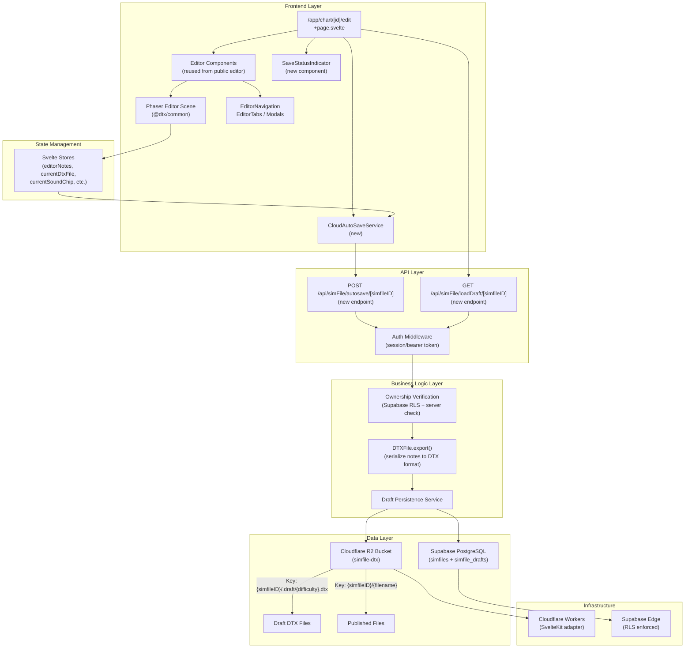
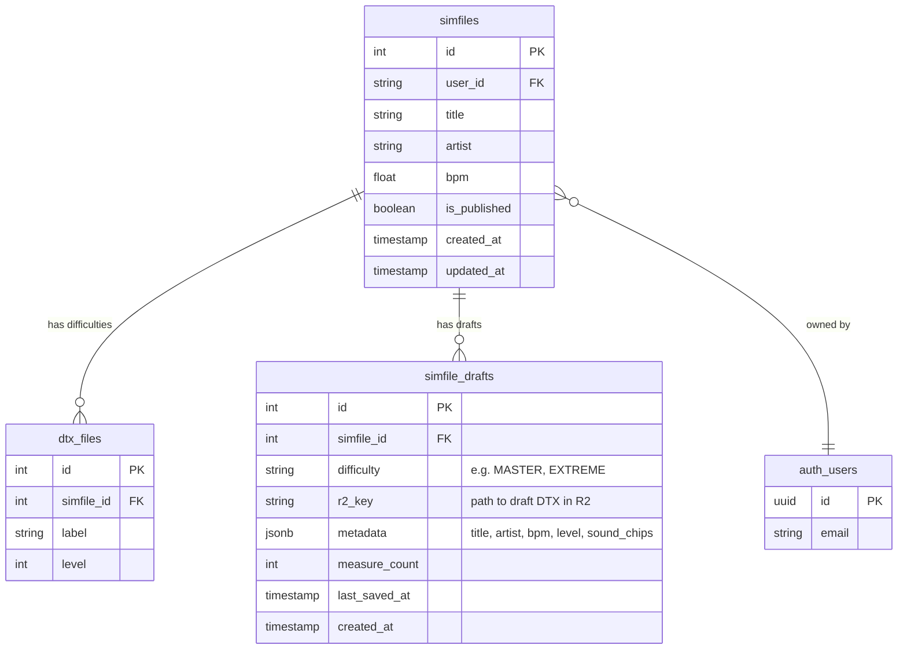
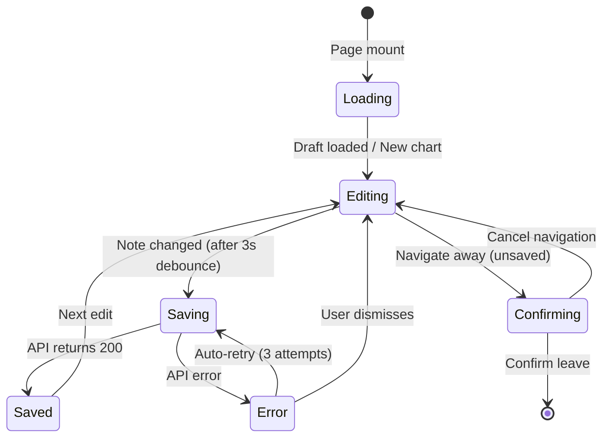

# Cloud Workspace: Private Editor with Autosave — Implementation Plan

## Goal

Enable authenticated users to open and edit their cloud-stored simfiles in a private editor that mirrors the existing public editor experience. Changes made in the private editor are automatically saved to the cloud (Supabase + Cloudflare R2) using a debounced autosave mechanism, eliminating the need for manual export or upload workflows. This creates a seamless "open → edit → close" experience where the user's work is always persisted.

## Requirements

- Authenticated users can navigate to their chart and open it in a private cloud editor
- The private editor provides the same editing capabilities as the existing public editor (note placement, sound chip management, BPM editing, preview playback, difficulty switching)
- Chart changes are automatically saved to the cloud after a debounce period (e.g., 3 seconds of inactivity)
- Visual feedback indicates save status: "Saved", "Saving...", "Unsaved changes", "Error saving"
- The private editor is only accessible to the simfile owner (enforced via RLS + server-side checks)
- Users can switch between difficulty levels within the same simfile in the private editor
- Sound/audio files linked to the simfile remain accessible during editing (loaded from R2)
- If the user navigates away with unsaved changes, a confirmation prompt prevents accidental data loss
- The private editor coexists with the public editor — the public editor continues to work as-is for anonymous/local usage

## Technical Considerations

### System Architecture Overview



### Technology Stack Selection

| Layer             | Technology                       | Rationale                                                 |
| ----------------- | -------------------------------- | --------------------------------------------------------- |
| **Frontend**      | Svelte 5 + SvelteKit 2           | Existing stack; reuse editor components                   |
| **Game Engine**   | Phaser 3.88                      | Existing editor scene; `autoSaveChart()` override pattern |
| **Cloud Storage** | Cloudflare R2                    | Already used for simfile assets; low-latency writes       |
| **Database**      | Supabase PostgreSQL              | Already used for metadata; RLS for auth                   |
| **Autosave**      | Custom debounced service         | Mirrors `TempChartStorage` pattern but targets R2         |
| **Auth**          | Supabase Auth (session + bearer) | Existing auth infrastructure                              |

### Integration Points

- **Editor Scene ↔ Cloud Autosave**: Override `autoSaveChart()` in private editor to call `CloudAutoSaveService` instead of `TempChartStorage`
- **R2 Storage**: Draft files stored under `{simfileID}/.draft/{difficulty}.dtx` prefix, separate from published assets
- **Supabase**: New `simfile_drafts` table tracks draft metadata (last saved timestamp, dirty state per difficulty)
- **Existing Upload Flow**: Publishing a draft promotes `.draft/` files to the main simfile prefix

### Deployment Architecture

- No new infrastructure needed — uses existing Cloudflare Workers deployment and Supabase instance
- R2 draft writes use the same `DTXFILE_BUCKET` binding
- Both production and pre-production share the same R2 bucket (existing behavior)

### Scalability Considerations

- Debounced saves (3s) limit R2 write frequency per user
- Draft files are small (DTX text format, typically <100KB)
- R2 handles concurrent writes natively (last-write-wins per key)
- Consider adding optimistic locking via `updated_at` timestamp if multi-device editing becomes a requirement

---

### Database Schema Design



#### Table: `simfile_drafts`

| Column          | Type          | Constraints                  | Description                       |
| --------------- | ------------- | ---------------------------- | --------------------------------- |
| `id`            | `serial`      | PK                           | Auto-increment ID                 |
| `simfile_id`    | `integer`     | FK → `simfiles.id`, NOT NULL | Parent simfile                    |
| `difficulty`    | `text`        | NOT NULL                     | Difficulty label (e.g., "MASTER") |
| `r2_key`        | `text`        | NOT NULL                     | R2 object key for draft DTX file  |
| `metadata`      | `jsonb`       | DEFAULT '{}'                 | Serialized chart metadata         |
| `measure_count` | `integer`     | DEFAULT 0                    | Number of measures                |
| `last_saved_at` | `timestamptz` | DEFAULT now()                | Last autosave timestamp           |
| `created_at`    | `timestamptz` | DEFAULT now()                | Record creation time              |

**Unique Constraint**: `(simfile_id, difficulty)` — one draft per difficulty per simfile.

#### Indexing Strategy

| Index                           | Columns                           | Rationale                                        |
| ------------------------------- | --------------------------------- | ------------------------------------------------ |
| `idx_simfile_drafts_simfile_id` | `simfile_id`                      | Fast lookup of all drafts for a simfile          |
| `idx_simfile_drafts_unique`     | `simfile_id, difficulty` (UNIQUE) | Enforce one draft per difficulty; upsert support |

#### RLS Policies

```sql
-- Users can only read their own drafts
CREATE POLICY "Users can read own drafts"
  ON simfile_drafts FOR SELECT
  USING (simfile_id IN (
    SELECT id FROM simfiles WHERE user_id = auth.uid()::text
  ));

-- Users can only insert/update their own drafts
CREATE POLICY "Users can write own drafts"
  ON simfile_drafts FOR ALL
  USING (simfile_id IN (
    SELECT id FROM simfiles WHERE user_id = auth.uid()::text
  ));
```

#### Migration Strategy

- Create a new Supabase migration file: `supabase/migrations/<timestamp>_create_simfile_drafts.sql`
- Apply via `supabase db push` or `supabase migration up`
- Generate updated TypeScript types with `bun run gen-types`

---

### API Design

#### 1. `POST /api/simFile/autosave/[simfileID]`

**Purpose**: Autosave draft chart data to R2 and update draft metadata in Supabase.

**Request**:

```typescript
// Content-Type: application/json
interface AutosaveRequest {
	difficulty: string; // e.g., "MASTER"
	dtxContent: string; // Full DTX file text (exported via DTXFile.export())
	metadata: {
		title: string;
		artist: string;
		bpm: number;
		level: number;
		soundChips: SoundChipData[];
	};
	measureCount: number;
}
```

**Response**:

```typescript
// 200 OK
interface AutosaveResponse {
	success: true;
	lastSavedAt: string; // ISO timestamp
	r2Key: string;
}

// 403 Forbidden (not owner)
// 404 Not Found (simfile doesn't exist)
// 400 Bad Request (validation error)
// 500 Internal Server Error
```

**Logic**:

1. Validate auth (session cookie or bearer token)
2. Verify simfile ownership via Supabase query
3. Upload DTX content to R2 at key `{simfileID}/.draft/{difficulty}.dtx`
4. Upsert `simfile_drafts` record with metadata + `last_saved_at = now()`
5. Return success with timestamp

#### 2. `GET /api/simFile/loadDraft/[simfileID]`

**Purpose**: Load draft data for a simfile (all difficulties or specific one).

**Request**:

```
GET /api/simFile/loadDraft/123?difficulty=MASTER
```

**Query Params**:
| Param | Required | Description |
|-------|----------|-------------|
| `difficulty` | No | If provided, loads only that difficulty's draft |

**Response**:

```typescript
// 200 OK
interface LoadDraftResponse {
	drafts: Array<{
		difficulty: string;
		r2Key: string;
		metadata: ChartMetadata;
		measureCount: number;
		lastSavedAt: string;
		dtxContent: string; // Full DTX text content from R2
	}>;
}

// 403 Forbidden / 404 Not Found
```

**Logic**:

1. Validate auth + ownership
2. Query `simfile_drafts` for simfile
3. Fetch DTX content from R2 for each draft
4. Return combined metadata + content

#### 3. `DELETE /api/simFile/deleteDraft/[simfileID]`

**Purpose**: Delete a specific draft when the user publishes or discards.

**Request**:

```
DELETE /api/simFile/deleteDraft/123?difficulty=MASTER
```

**Logic**:

1. Validate auth + ownership
2. Delete R2 object at `.draft/{difficulty}.dtx`
3. Delete `simfile_drafts` record

#### Authentication & Authorization

- All endpoints require authentication via Supabase session cookie or `Authorization: Bearer <token>` header
- Ownership verified by joining `simfile_drafts` → `simfiles` → checking `user_id = auth.uid()`
- Desktop app identified via `User-Agent: DTXDesktopApp` header (existing pattern)

#### Error Handling

| Status | Scenario                                                         |
| ------ | ---------------------------------------------------------------- |
| 400    | Missing/invalid difficulty, empty DTX content, invalid simfileID |
| 401    | No auth session or expired token                                 |
| 403    | User does not own the simfile                                    |
| 404    | Simfile does not exist                                           |
| 413    | DTX content exceeds 10MB limit                                   |
| 500    | R2 write failure or Supabase error                               |

#### Rate Limiting

- Autosave endpoint: Max 20 requests/minute per user (server-side, via Cloudflare rate limiting rules)
- Client-side debounce (3 seconds) naturally limits request frequency

---

### Frontend Architecture

#### Component Hierarchy

```
Private Editor Page (/app/chart/[id]/edit)
├── +layout.svelte (inherited from (app) group — sidebar, auth guard)
├── +page.server.ts (load simfile metadata + draft data)
├── +page.svelte (main orchestrator)
│   ├── SaveStatusIndicator (new — shows "Saved ✓" / "Saving..." / "Unsaved")
│   │   └── Status badge with animated transitions
│   ├── EditorNavigation (reused from public editor)
│   │   ├── File menu (modified: "Save to Cloud" replaces "Export")
│   │   └── Difficulty switcher
│   ├── EditorTabs (reused)
│   │   ├── MainTab (chart properties, grid spacing)
│   │   ├── PreviewTab (play/preview controls)
│   │   └── SoundTab (sound chip management)
│   ├── Main / PhaserGame (reused — Phaser container)
│   │   └── Editor Scene (overrides autoSaveChart → CloudAutoSaveService)
│   ├── DifficultyModal (reused — switch difficulty, triggers draft load/save)
│   ├── DiscardModal (reused — with "discard cloud draft" option)
│   └── SoundLibraryModal (reused)
```

#### New: `CloudAutoSaveService`

```
CloudAutoSaveService (singleton per editor session)
├── Properties
│   ├── simfileID: string
│   ├── difficulty: string
│   ├── saveStatus: Writable<'idle' | 'saving' | 'saved' | 'error'>
│   ├── lastSavedAt: Writable<Date | null>
│   ├── pendingSave: boolean
│   └── retryCount: number
├── Methods
│   ├── save(notes, bpmNotes, measureCount, metadata) → Promise<void>
│   │   ├── Exports notes to DTX text via DTXFile.export()
│   │   ├── POSTs to /api/simFile/autosave/[simfileID]
│   │   ├── Updates saveStatus store
│   │   └── Retries on failure (max 3 attempts, exponential backoff)
│   ├── load(difficulty?) → Promise<DraftData>
│   ├── switchDifficulty(newDifficulty) → void
│   └── destroy() → void (cleanup)
```

#### New: `SaveStatusIndicator.svelte`

```
SaveStatusIndicator
├── Props
│   ├── status: 'idle' | 'saving' | 'saved' | 'error'
│   └── lastSavedAt: Date | null
├── Display
│   ├── idle → (hidden or subtle "Ready")
│   ├── saving → "Saving..." with spinner
│   ├── saved → "Saved ✓" with relative timestamp ("2s ago")
│   └── error → "Save failed" with retry button
```

#### State Flow



#### State Management

- Reuses all existing Svelte stores from `@dtx/common/store.ts` (`editorNotes`, `currentDtxFile`, `currentSoundChip`, etc.)
- Adds new stores scoped to the private editor:
    - `saveStatus`: `Writable<'idle' | 'saving' | 'saved' | 'error'>`
    - `lastCloudSave`: `Writable<Date | null>`
- `CloudAutoSaveService` subscribes to `editorNotes` changes and triggers debounced saves

#### TypeScript Interfaces

```typescript
interface CloudDraft {
	simfileId: number;
	difficulty: string;
	r2Key: string;
	metadata: ChartMetadata;
	measureCount: number;
	lastSavedAt: Date;
	dtxContent: string;
}

interface ChartMetadata {
	title: string;
	artist: string;
	bpm: number;
	level: number;
	soundChips: SoundChipData[];
}

interface SoundChipData {
	id: string;
	label: string;
	volume: number;
	position: number;
	fileName: string;
	filePath?: string;
	fileHash?: string;
}

type SaveStatus = 'idle' | 'saving' | 'saved' | 'error';
```

---

### Security & Performance

#### Authentication & Authorization

- Route protected by `(app)` layout group (redirects unauthenticated users to `/login`)
- Server-side ownership check in `+page.server.ts` `load()` function
- API endpoints verify ownership via Supabase RLS + explicit `user_id` check
- CSRF protection inherited from existing `hooks.server.ts`

#### Data Validation & Sanitization

- Simfile ID validated as safe integer (existing pattern)
- Difficulty string validated against allowed values
- DTX content size limit: 10MB
- Metadata fields sanitized (XSS prevention on title/artist)

#### Performance Optimization

- **Debounced saves**: 3-second debounce prevents excessive API calls during rapid editing
- **Diff-based saves** (future optimization): Only send changed measures instead of full DTX content
- **Optimistic UI**: Save status updates immediately; rolls back on error
- **R2 direct writes**: No intermediate storage; DTX content written directly to R2
- **Lazy draft loading**: Only load the active difficulty's draft content; load others on demand

#### Caching

- Draft metadata cached in `simfile_drafts` table (avoid R2 list operations)
- Published simfile metadata cached via existing SimFile cache (5-minute TTL)
- No browser caching of draft content (always fetch latest from R2 to prevent stale edits)
- `beforeunload` event listener prevents accidental navigation during pending saves

---

## Implementation Phases

### Phase 1: Database & API Foundation

1. Create `simfile_drafts` migration with RLS policies
2. Generate updated Supabase TypeScript types
3. Implement `POST /api/simFile/autosave/[simfileID]` endpoint
4. Implement `GET /api/simFile/loadDraft/[simfileID]` endpoint
5. Implement `DELETE /api/simFile/deleteDraft/[simfileID]` endpoint
6. Write API endpoint tests

### Phase 2: Cloud Autosave Service

7. Create `CloudAutoSaveService` class with debounced save logic
8. Implement save status stores (`saveStatus`, `lastCloudSave`)
9. Implement retry logic with exponential backoff
10. Integrate with `DTXFile.export()` for serialization

### Phase 3: Private Editor Route & UI

11. Create `/app/chart/[id]/edit` route with `+page.server.ts` (load simfile + draft)
12. Create `+page.svelte` that reuses public editor components with `CloudAutoSaveService`
13. Create `SaveStatusIndicator.svelte` component
14. Wire `autoSaveChart()` override to `CloudAutoSaveService.save()`
15. Implement difficulty switching with draft save/load per difficulty
16. Add `beforeunload` guard for unsaved changes

### Phase 4: Navigation & Integration

17. Add "Edit" button to chart detail page (`/app/chart/[id]`) linking to `/app/chart/[id]/edit`
18. Add "Edit in Cloud" link from My Charts list
19. Handle edge cases: deleted simfiles, expired sessions, concurrent edits
20. End-to-end testing of the full flow

### Phase 5: Polish & Hardening

21. Optimize save payload size (measure-level diffing — future)
22. Add keyboard shortcut for manual save (Ctrl+S)
23. Handle offline/reconnection gracefully (queue saves, retry on reconnect)
24. Performance testing under realistic editing load
