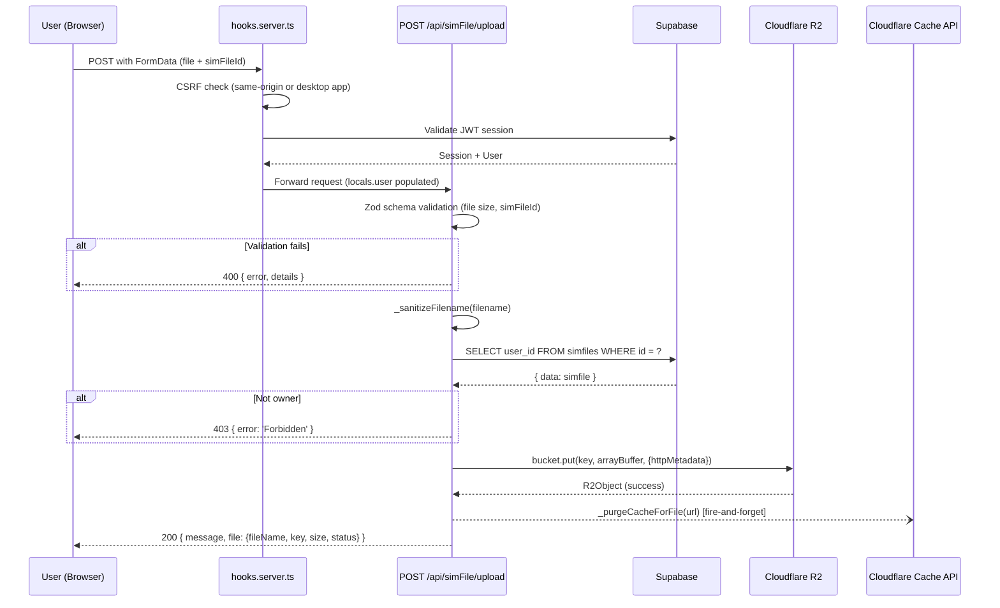
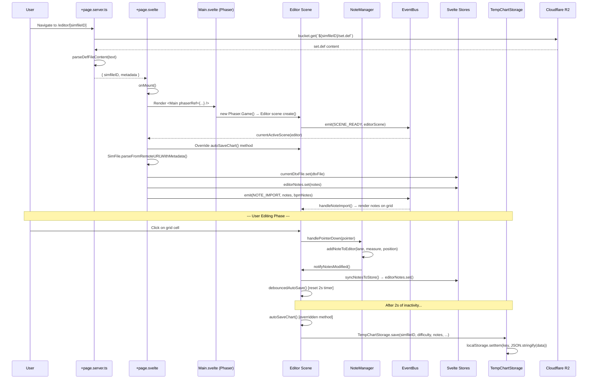
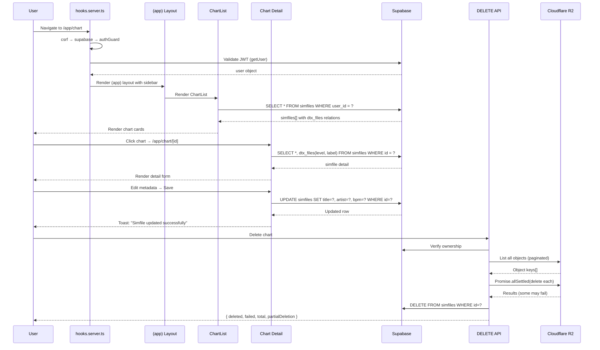

# Drumery — Project Workflow Analysis Blueprint

## Technology Stack Detection

| Layer                   | Technology                       | Version                            |
| ----------------------- | -------------------------------- | ---------------------------------- |
| **Frontend Framework**  | Svelte 5 + SvelteKit 2.x         | Svelte 5 (runes), SvelteKit 2      |
| **Language**            | TypeScript 5.x                   | Strict mode                        |
| **Game Engine**         | Phaser 3.88                      | Custom scenes for editor/preview   |
| **Styling**             | TailwindCSS 4.x + Skeleton UI    | Utility-first + component library  |
| **Backend Runtime**     | Cloudflare Workers               | Via @sveltejs/adapter-cloudflare   |
| **Database**            | Supabase PostgreSQL              | Auth + RLS + real-time             |
| **Object Storage**      | Cloudflare R2                    | S3-compatible, via Workers binding |
| **Package Manager**     | Bun 1.3.9                        | Workspaces-based monorepo          |
| **Build Orchestration** | Turborepo                        | Caching + task pipeline            |
| **Testing**             | Vitest (unit) + Playwright (E2E) | jsdom environment                  |
| **Desktop**             | Electron 35.x                    | IPC bridge to Svelte frontend      |

### Architecture Pattern: Layered Monorepo

```
┌─────────────────────────────────────────────────┐
│ Route Layer (SvelteKit pages & API endpoints)    │
│   +page.svelte / +page.server.ts / +server.ts   │
├─────────────────────────────────────────────────┤
│ Component Layer (Svelte 5 components)            │
│   EditorNavigation, EditorTabs, Modals           │
├─────────────────────────────────────────────────┤
│ Game Layer (Phaser 3 scenes)                     │
│   Editor, Preview, MainMenu, Preloader           │
├─────────────────────────────────────────────────┤
│ Service Layer (static classes & singletons)       │
│   TempChartStorage, WorkspaceService, SoundLib   │
├─────────────────────────────────────────────────┤
│ Domain Layer (core models)                       │
│   DTXFile, SimFile, SoundChip, LaneMeasureNote   │
├─────────────────────────────────────────────────┤
│ Data Access Layer                                │
│   Supabase Client (RLS) + R2 Bucket bindings     │
└─────────────────────────────────────────────────┘
```

### Monorepo Package Dependency Graph

```
packages/dtx-web ──────► @dtx/common
packages/dtx-desktop ──► @dtx/common
packages/dtx-web ──────► @dtx/ui-components
```

---

## Workflow 1: SimFile Upload (API → R2 → Supabase)

### 1.1 Overview

| Attribute            | Value                                                                                                                  |
| -------------------- | ---------------------------------------------------------------------------------------------------------------------- |
| **Name**             | SimFile Upload                                                                                                         |
| **Business Purpose** | Allow authenticated users to upload DTX game files (charts + audio assets) to cloud storage for publishing and sharing |
| **Trigger**          | User uploads a file via the Chart Detail page (`/app/chart/[id]`)                                                      |
| **Entry Point**      | `POST /api/simFile/upload`                                                                                             |

**Files Involved:**
| File | Role |
|------|------|
| `packages/dtx-web/src/routes/api/simFile/upload/+server.ts` | API endpoint handler |
| `packages/dtx-web/src/routes/(app)/app/chart/[id]/+page.svelte` | Upload UI |
| `packages/dtx-web/src/hooks.server.ts` | Auth guard + CSRF |
| `packages/dtx-web/src/lib/server/logger.ts` | Winston logger |
| `packages/dtx-web/src/lib/validation/` | Upload validation schemas |

### 1.2 Entry Point Implementation

**Route:** `packages/dtx-web/src/routes/api/simFile/upload/+server.ts`

```typescript
// Method signature
export const POST: RequestHandler = async ({ request, locals, platform }) => { ... }
```

**Request Model (Zod-validated FormData):**

```typescript
const MAX_FILE_SIZE = 50 * 1024 * 1024; // 50MB

const uploadSchema = z.object({
	file: z.instanceof(File).refine((f) => f.size <= MAX_FILE_SIZE, 'File too large (max 50MB)'),
	simFileId: z.string().min(1, 'SimFile ID is required')
});
```

**Authentication Pattern:**

```typescript
// Auth provided by hooks.server.ts — populates locals.user
const user = locals.user;
if (!user) {
	return json({ error: 'Unauthorized' }, { status: 401 });
}
```

**Authorization Pattern (Ownership Check):**

```typescript
const { data: simfile, error: simfileError } = await locals.supabase
	.from('simfiles')
	.select('user_id')
	.eq('id', simfileIdValue)
	.maybeSingle();

if (!simfile) return json({ error: 'SimFile not found' }, { status: 404 });
if (simfile.user_id !== user.id) return json({ error: 'Forbidden' }, { status: 403 });
```

### 1.3 Service Layer Implementation

No separate service class — business logic is inline in the API handler (thin controller pattern for Cloudflare Workers).

**Filename Sanitization (inline helper):**

```typescript
const _sanitizeFilename = (filename: string): string => {
	let sanitized = filename;
	// Iteratively remove path traversal patterns
	while (sanitized.includes('../') || sanitized.includes('..\\')) {
		sanitized = sanitized.replace(/\.\.\//g, '').replace(/\.\.\\/g, '');
	}
	// Remove leading/trailing slashes, null bytes, control characters
	// Truncate to 1024 chars preserving extension
	return sanitized || `file_${Date.now()}`;
};
```

### 1.4 Data Access Implementation

**R2 Bucket Write:**

```typescript
const bucket = platform?.env?.DTXFILE_BUCKET as R2Bucket;
const key = `${canonicalSimfileId}/${sanitizedFilename}`;

const result = await bucket.put(key, await validatedFile.arrayBuffer(), {
	httpMetadata: {
		contentType: validatedFile.type,
		cacheControl: 'public, max-age=31536000' // 1-year cache
	}
});
```

**Cloudflare Cache Purge (fire-and-forget):**

```typescript
const _purgeCacheForFile = async (fileUrl: string) => {
	const response = await fetch(
		`https://api.cloudflare.com/client/v4/zones/${zoneId}/purge_cache`,
		{
			method: 'POST',
			headers: { Authorization: `Bearer ${apiToken}` },
			body: JSON.stringify({ files: [fileUrl] })
		}
	);
};

// Non-blocking — doesn't fail the upload
_purgeCacheForFile(fileUrl).catch((err) => logger.error('Cache purge error:', err));
```

### 1.5 Response Construction

```typescript
// 200 Success
return json({
	message: 'File uploaded successfully',
	file: {
		fileName: sanitizedFilename,
		key,
		size: validatedFile.size,
		contentType: validatedFile.type,
		status: 'Uploaded'
	}
});

// Error responses
return json({ error: 'Invalid input data', details: validation.error.issues }, { status: 400 });
return json({ error: 'Unauthorized' }, { status: 401 });
return json({ error: 'Forbidden' }, { status: 403 });
return json({ error: 'SimFile not found' }, { status: 404 });
return json({ error: 'Internal server error', message: err.message }, { status: 500 });
```

### 1.6 Error Handling Patterns

```typescript
try {
	// 1. Validate auth (early return)
	// 2. Validate input with Zod (safeParse, not parse — no exceptions)
	// 3. Validate ownership via Supabase
	// 4. Sanitize filename
	// 5. Upload to R2
	// 6. Purge cache (fire-and-forget)
} catch (error) {
	logger.error('Upload error:', error);
	return json(
		{
			error: 'Internal server error',
			message: error instanceof Error ? error.message : 'Unknown error'
		},
		{ status: 500 }
	);
}
```

**Key Pattern:** Supabase returns `{ data, error }` objects (never throws), so errors are checked explicitly rather than caught.

### 1.7 Sequence Diagram



---

## Workflow 2: Editor Load & Note Editing with Autosave

### 2.1 Overview

| Attribute            | Value                                                                                                                 |
| -------------------- | --------------------------------------------------------------------------------------------------------------------- |
| **Name**             | Editor Load & Autosave                                                                                                |
| **Business Purpose** | Load a DTX chart (local or remote), render in Phaser editor, allow note editing, and autosave changes to localStorage |
| **Trigger**          | User navigates to `/editor` or `/editor/[simfileID]`                                                                  |
| **Entry Point**      | SvelteKit page load (`+page.server.ts` → `+page.svelte`)                                                              |

**Files Involved:**
| File | Role |
|------|------|
| `packages/dtx-web/src/routes/(game)/editor/[[simfileID]]/+page.server.ts` | Server-side data loading |
| `packages/dtx-web/src/routes/(game)/editor/[[simfileID]]/+page.svelte` | Main editor orchestrator (634 lines) |
| `packages/common/src/lib/game/scenes/Editor.ts` | Phaser editor scene |
| `packages/common/src/lib/game/NoteManager.ts` | Note manipulation logic |
| `packages/common/src/lib/game/EventBus.ts` | Svelte ↔ Phaser bridge |
| `packages/common/src/lib/store.ts` | Global reactive stores |
| `packages/common/src/lib/chart/dtx.ts` | DTXFile parser/exporter |
| `packages/common/src/lib/chart/simFile.ts` | SimFile remote loader |
| `packages/dtx-web/src/lib/services/tempChartStorage.ts` | Local autosave service |
| `packages/dtx-web/src/lib/components/editor/` | Editor UI components |

### 2.2 Entry Point: Server Load

**Route:** `packages/dtx-web/src/routes/(game)/editor/[[simfileID]]/+page.server.ts`

```typescript
export const load: PageServerLoad = async ({ params, platform }) => {
	const { simfileID } = params;

	// No simfileID → local-only editor
	if (!simfileID) return { simfileID: undefined, metadata: null };

	// Fetch set.def from R2 bucket
	const bucket = platform?.env?.DTXFILE_BUCKET as R2Bucket;
	const defObject = await bucket.get(`${simfileID}/set.def`);

	if (!defObject) {
		throw error(404, `SimFile ${simfileID} not found`);
	}

	const textContent = await defObject.text();
	const metadata = await parseDefFileContent(textContent);

	return { simfileID, metadata };
};
```

**Error Handling — Re-throw SvelteKit errors:**

```typescript
catch (err) {
  if (err && typeof err === 'object' && 'status' in err && 'body' in err) {
    throw err;  // Preserve SvelteKit HttpError
  }
  throw error(500, `Failed to load SimFile metadata`);
}
```

### 2.3 Entry Point: Page Component Initialization

**Route:** `packages/dtx-web/src/routes/(game)/editor/[[simfileID]]/+page.svelte`

```typescript
// Svelte 5 runes for page state
let simfileID = $state('');
let isEditorReady = $state(false);
let isPreviewing = $state(false);
let phaserRef: TPhaserRef = { game: null, scene: null };

// Data from server load
let { data } = $props();

onMount(async () => {
	simfileID = data.simfileID || '';
	store.currentSimfileID.set(simfileID || null);

	if (data.metadata) {
		// Remote chart: parse from R2
		const simFile = await SimFile.parseFromRemoteURLWithMetadata(
			simfileID,
			PUBLIC_SIMFILE_BUCKET_URL,
			data.metadata
		);
		const dtxFile = simFile.getLevel();
		const notes = dtxFile.parseNotes();
		const soundChips = dtxFile.parseSoundChips();

		store.currentDtxFile.set(dtxFile);
		store.currentSoundChip.set(soundChips);
		store.editorNotes.set(notesRecord);

		// Fetch audio files in parallel
		await Promise.all(
			soundChips.map((chip) => chip.fetchRemote(simfileID, PUBLIC_SIMFILE_BUCKET_URL))
		);

		// Trigger Phaser scene to import notes
		EventBus.emit(EventType.NOTE_IMPORT, notesRecord, bpmNotes);
	} else {
		// Local editor: check for temp data or create new file
		const tempData = TempChartStorage.load(null, 'Imported');
		if (tempData) {
			/* restore from temp */
		} else {
			newFile();
		}
	}
});
```

### 2.4 Game Layer: Phaser Editor Scene

**Scene:** `packages/common/src/lib/game/scenes/Editor.ts`

```typescript
export class Editor extends Phaser.Scene {
	static key = 'Editor';
	private noteManager!: NoteManager;
	private AUTO_SAVE_DELAY_MS = 2000;
	private autoSaveTimeout: Phaser.Time.TimerEvent | null = null;

	create() {
		// Initialize grid, lanes, note display
		this.noteManager = new NoteManager(this);
		this.noteManager.setOnNotesModified(() => this.debouncedAutoSave());

		// Listen for events from Svelte UI
		EventBus.on(EventType.NOTE_IMPORT, this.handleNoteImport, this);
		EventBus.on(EventType.MEASURE_UPDATE, this.handleMeasureUpdate, this);
		EventBus.on(EventType.GRID_SPACING_UPDATE, this.handleGridChange, this);

		// Store subscriptions
		store.activeNote.subscribe((noteId) => {
			/* update cursor */
		});
		store.keyBindings.subscribe((bindings) => {
			/* update key map */
		});

		EventBus.emit(EventType.SCENE_READY, this);
	}

	syncNotesToStore() {
		store.editorNotes.set({ ...this.notes });
	}
}
```

### 2.5 Autosave: Debounced Local Persistence

**Debounce Mechanism (Editor.ts):**

```typescript
private debouncedAutoSave(): void {
  if (this.autoSaveTimeout !== null) {
    this.autoSaveTimeout.destroy();
  }
  this.autoSaveTimeout = this.time.delayedCall(
    this.AUTO_SAVE_DELAY_MS,   // 2 seconds
    async () => {
      await this.autoSaveChart();
      this.autoSaveTimeout = null;
    }
  );
}

// Override point — base implementation is empty
public async autoSaveChart(): Promise<void> { }
```

**Override in +page.svelte (duck-typing):**

```typescript
const currentActiveScene = (scene: Scene) => {
	if (scene.scene.key === Editor.key) {
		const editor = scene as Editor;
		editor.autoSaveChart = async () => {
			const dtxFile = get(store.currentDtxFile);
			const notes = get(store.editorNotes);
			TempChartStorage.save(
				simfileID || null,
				get(store.currentDifficulty),
				notes,
				bpmNotes,
				get(store.measureCount),
				{
					title: dtxFile?.title,
					artist: dtxFile?.artist,
					bpm: dtxFile?.bpm,
					level: dtxFile?.level,
					soundChips: get(store.currentSoundChip)
				}
			);
		};
	}
};
```

**TempChartStorage (service):**

```typescript
export class TempChartStorage {
	private static readonly STORAGE_KEY_PREFIX = 'dtx_temp_chart_';
	private static readonly MAX_AGE_MS = 7 * 24 * 60 * 60 * 1000; // 7 days

	static save(simFileID, difficulty, notes, bpmNotes, measureCount, metadata): void {
		const key = this.buildStorageKey(simFileID, difficulty);
		const data = { notes, bpmNotes, measureCount, metadata, timestamp: Date.now() };
		try {
			localStorage.setItem(this.STORAGE_KEY_PREFIX + key, JSON.stringify(data));
		} catch (error) {
			console.warn('Failed to save temporary chart data:', error);
		}
	}

	static load(simFileID, difficulty): TempChartData | null {
		const raw = localStorage.getItem(this.STORAGE_KEY_PREFIX + key);
		if (!raw) return null;
		const data = JSON.parse(raw);
		if (Date.now() - data.timestamp > this.MAX_AGE_MS) {
			this.remove(simFileID, difficulty); // Lazy purge
			return null;
		}
		return data;
	}
}
```

### 2.6 Data Flow: Note Edit Lifecycle

```
User clicks grid cell
    → NoteManager.handlePointerDown()
    → NoteManager.addNoteToEditor(lane, measure, position, noteID)
    → Editor.notes[laneID].push(note)
    → Editor.syncNotesToStore()     → store.editorNotes.set(notes)
    → NoteManager.notifyNotesModified()
    → Editor.debouncedAutoSave()    → [2s delay]
    → Editor.autoSaveChart()        → [overridden]
    → TempChartStorage.save(...)    → localStorage.setItem(...)
```

### 2.7 Sequence Diagram



---

## Workflow 3: Authenticated Chart Management (CRUD)

### 3.1 Overview

| Attribute            | Value                                                                                            |
| -------------------- | ------------------------------------------------------------------------------------------------ |
| **Name**             | Chart CRUD Operations                                                                            |
| **Business Purpose** | Allow authenticated users to create, view, update, and delete their simfile charts with metadata |
| **Trigger**          | User navigates to `/app/chart` (list) or `/app/chart/[id]` (detail)                              |
| **Entry Point**      | (app) layout group → page loads → Supabase queries                                               |

**Files Involved:**
| File | Role |
|------|------|
| `packages/dtx-web/src/hooks.server.ts` | Auth guard (3 hooks in sequence) |
| `packages/dtx-web/src/routes/(app)/+layout.server.ts` | Forces dynamic routing for auth |
| `packages/dtx-web/src/routes/(app)/+layout.svelte` | Dashboard sidebar + nav |
| `packages/dtx-web/src/routes/(app)/app/chart/+page.svelte` | Chart list page |
| `packages/dtx-web/src/routes/(app)/app/chart/[id]/+page.svelte` | Chart detail page |
| `packages/dtx-web/src/lib/components/ChartList.svelte` | Chart list component |
| `packages/dtx-web/src/routes/api/simFile/delete/[simfileID]/+server.ts` | Delete endpoint |
| `packages/dtx-web/src/routes/api/simFile/upload/+server.ts` | Upload endpoint |

### 3.2 Authentication Flow (Cross-Cutting)

**hooks.server.ts** uses `sequence()` to chain three hooks:

```typescript
export const handle: Handle = sequence(csrf, supabase, authGuard);
```

**Hook 1: CSRF Protection**

```typescript
const csrf: Handle = async ({ event, resolve }) => {
	const forbidden =
		isFormContentType(event.request) &&
		['POST', 'PUT', 'PATCH', 'DELETE'].includes(event.request.method) &&
		!isSameOrigin(event) &&
		!isDesktopApp(event); // Whitelist desktop app
	if (forbidden)
		return json({ message: 'Cross-site POST form submissions are forbidden' }, { status: 403 });
	return resolve(event);
};
```

**Hook 2: Supabase Client Setup**

```typescript
const supabase: Handle = async ({ event, resolve }) => {
	event.locals.supabase = createServerClient(SUPABASE_URL, SUPABASE_ANON_KEY, {
		cookies: {
			getAll: () => event.cookies.getAll(),
			setAll: (cookies) => {
				/* ... */
			}
		}
	});

	event.locals.safeGetSession = async () => {
		const {
			data: { session }
		} = await event.locals.supabase.auth.getSession();
		if (!session) return { session: null, user: null };

		// Validate JWT — don't trust getSession() alone
		const {
			data: { user },
			error
		} = await event.locals.supabase.auth.getUser();
		if (error) return { session: null, user: null };

		return { session: Object.assign({}, session, { user }), user };
	};
};
```

**Hook 3: Auth Guard**

```typescript
const authGuard: Handle = async ({ event, resolve }) => {
	const { session, user } = await event.locals.safeGetSession();
	event.locals.session = session;
	event.locals.user = user;

	// Redirect unauthenticated users from /app/* to /login
	if (!session && event.url.pathname.startsWith('/app')) {
		throw redirect(303, `/login?redirect=${encodeURIComponent(event.url.pathname)}`);
	}

	// Redirect authenticated users from /login to /app
	if (session && event.url.pathname === '/login') {
		throw redirect(303, '/app');
	}

	// Bearer token support for API routes (desktop app)
	if (!event.locals.session && event.url.pathname.startsWith('/api/simFile')) {
		const authHeader = event.request.headers.get('Authorization');
		if (authHeader?.toLowerCase().startsWith('bearer ')) {
			const token = authHeader.slice(7);
			const { data: userData, error: userError } =
				await event.locals.supabase.auth.getUser(token);
			if (!userError && userData.user) {
				event.locals.user = userData.user;
				// Create synthetic session + Supabase client with bearer token
			}
		}
	}

	return resolve(event);
};
```

### 3.3 Chart List (Read)

**Component:** `packages/dtx-web/src/lib/components/ChartList.svelte`

```typescript
// Props
interface Props {
	supabase: SupabaseClient;
	session: Session;
}

// Fetch user's charts
async function loadCharts() {
	const { data, error } = await supabase
		.from('simfiles')
		.select('*, dtx_files(level, label)')
		.eq('user_id', session.user.id)
		.order('updated_at', { ascending: false });

	if (error) {
		toastStore.error({ title: 'Failed to load charts', duration: 3000 });
		return;
	}
	charts = data;
}

// Toggle publish
async function togglePublishChart(id: number, published: boolean) {
	const { error } = await supabase
		.from('simfiles')
		.update({ is_published: !published })
		.eq('id', id);

	if (error) {
		toastStore.error({ title: `Failed to ${published ? 'unpublish' : 'publish'} chart` });
	} else {
		toastStore.success({ title: `Chart ${published ? 'unpublished' : 'published'}` });
		await loadCharts(); // Refresh list
	}
}
```

### 3.4 Chart Detail (Update)

**Component:** `packages/dtx-web/src/routes/(app)/app/chart/[id]/+page.svelte`

```typescript
// Load simfile details
async function loadSimfileDetails(id: string) {
	try {
		const { data, error: fetchError } = await supabase
			.from('simfiles')
			.select('*, dtx_files(level, label)')
			.eq('id', id)
			.single();
		if (fetchError) throw fetchError;
		simfile = data;
	} catch (e: unknown) {
		error = e instanceof Error ? e.message : 'Failed to load chart';
	} finally {
		loading = false;
	}
}

// Update simfile metadata
async function updateSimfile() {
	const { data, error } = await supabase
		.from('simfiles')
		.update({
			title: simfile.title,
			artist: simfile.artist,
			bpm: simfile.bpm,
			download_url: simfile.download_url,
			video_preview_url: simfile.video_preview_url,
			is_published: simfile.is_published,
			display_id: simfile.display_id
		})
		.eq('id', simfile.id)
		.select()
		.single();

	if (!data || error) {
		toastStore.error({ title: 'Error updating simfile', duration: 5000 });
	} else {
		toastStore.success({ title: 'Simfile updated successfully', duration: 3000 });
	}
}
```

### 3.5 Chart Delete

**API Endpoint:** `DELETE /api/simFile/delete/[simfileID]`

```typescript
export const DELETE: RequestHandler = async ({ params, locals, platform }) => {
	// 1. Validate simfileID format (numeric, safe integer)
	// 2. Auth check (locals.user)
	// 3. Ownership verification (Supabase query)
	// 4. R2 paginated deletion (cursor-based, 1000 items/page)
	const deleteResults = await Promise.allSettled(allObjects.map((obj) => bucket.delete(obj.key)));
	// 5. Track partial failures
	// 6. Always attempt Supabase record deletion
	// 7. Return detailed response with deletion stats
};
```

**Key Pattern — Partial Failure Handling:**

```typescript
const successfulDeletions = deleteResults.filter((r) => r.status === 'fulfilled');
const failedDeletions = deleteResults.filter((r) => r.status === 'rejected');

// Log failed deletions with reasons
if (failedDeletions.length > 0) {
	const failedDetails = deleteResults
		.map((result, index) => {
			if (result.status === 'rejected') {
				return { key: allObjects[index]?.key, reason: result.reason?.message };
			}
			return null;
		})
		.filter(Boolean);
	logger.error(`Failed to delete ${failedDeletions.length} files:`, failedDetails);
}

// Always delete DB record even if some R2 files failed
const { error: deleteError } = await locals.supabase.from('simfiles').delete().eq('id', id);
```

### 3.6 Sequence Diagram



---

## Cross-Cutting Patterns

### Naming Conventions

| Entity                 | Convention                          | Examples                                                 |
| ---------------------- | ----------------------------------- | -------------------------------------------------------- |
| **Routes**             | SvelteKit file-based                | `+page.svelte`, `+page.server.ts`, `+server.ts`          |
| **Route Groups**       | Parenthesized                       | `(app)`, `(game)`, `(blog)`, `(login)`, `(tool)`         |
| **API Routes**         | REST-like under `/api/`             | `/api/simFile/upload`, `/api/simFile/delete/[simfileID]` |
| **Services**           | camelCase files, PascalCase classes | `tempChartStorage.ts` → `TempChartStorage`               |
| **Components**         | PascalCase files                    | `ChartList.svelte`, `EditorNavigation.svelte`            |
| **Stores**             | camelCase, descriptive              | `currentDtxFile`, `editorNotes`, `isPreviewing`          |
| **Domain Models**      | PascalCase classes                  | `DTXFile`, `SimFile`, `SoundChip`, `LaneMeasureNote`     |
| **Event Types**        | UPPER_SNAKE in enum                 | `EventType.SCENE_READY`, `EventType.NOTE_IMPORT`         |
| **Props Interface**    | Always `Props`                      | `interface Props { ... }`                                |
| **Event Handlers**     | `handle` prefix or `on` prefix      | `handleClick`, `onImportFile`                            |
| **Route Params**       | camelCase in brackets               | `[simfileID]`, `[[simfileID]]`                           |
| **DB Tables**          | snake_case                          | `simfiles`, `dtx_files`, `user_profiles`                 |
| **DB Columns**         | snake_case                          | `user_id`, `is_published`, `created_at`                  |
| **API Error Response** | `{ error: string }`                 | `{ error: 'Unauthorized' }`                              |
| **Logger**             | Winston default import              | `import logger from '$lib/server/logger'`                |
| **Toast**              | Default import                      | `import toastStore from '$lib/toaster'`                  |

### File Organization

```
packages/dtx-web/src/
├── routes/
│   ├── (app)/                    # Authenticated routes
│   │   ├── +layout.server.ts     # Force dynamic (auth trigger)
│   │   ├── +layout.svelte        # Dashboard shell
│   │   └── app/
│   │       ├── chart/            # Chart management
│   │       └── score/            # Score tracking
│   ├── (game)/                   # Game routes (public)
│   │   └── editor/[[simfileID]]/ # Editor with optional param
│   ├── (blog)/                   # Public chart discovery
│   ├── (tool)/                   # Conversion tools
│   ├── (login)/                  # Auth pages
│   └── api/                      # Server-side endpoints
│       ├── auth/                 # Auth endpoints
│       └── simFile/              # SimFile CRUD
├── lib/
│   ├── components/               # Reusable UI components
│   │   └── editor/               # Editor-specific components
│   ├── services/                 # Business logic services
│   ├── server/                   # Server-only utilities
│   ├── validation/               # Schema validation
│   ├── i18n/                     # Internationalization
│   ├── store.ts                  # [Re-exports from @dtx/common]
│   ├── supabase.ts               # Client initialization
│   ├── toaster.ts                # Toast notifications
│   └── utils.ts                  # Shared helpers
└── hooks.server.ts               # Auth + CSRF middleware

packages/common/src/lib/
├── chart/                        # Domain models
│   ├── dtx.ts                    # DTXFile class
│   ├── simFile.ts                # SimFile class
│   └── note.ts                   # LaneMeasureNote class
├── game/                         # Phaser game layer
│   ├── scenes/                   # Editor, Preview, MainMenu, Preloader
│   ├── NoteManager.ts            # Note CRUD operations
│   ├── EventBus.ts               # Phaser EventEmitter
│   └── EventType.ts              # Event type enum
├── services/                     # Abstract service interfaces
│   ├── fileProvider.ts           # IFileProvider interface
│   ├── fileManager.ts            # In-memory file store
│   └── assetFileService.ts       # Asset loading service
├── store.ts                      # Svelte writable stores
└── components/                   # Shared Svelte components
```

---

## Implementation Templates

### Template 1: New API Endpoint

```typescript
// packages/dtx-web/src/routes/api/{resource}/{action}/+server.ts
import { json, type RequestHandler } from '@sveltejs/kit';
import logger from '$lib/server/logger';

export const POST: RequestHandler = async ({ request, locals, platform }) => {
	try {
		// 1. Auth check
		const user = locals.user;
		if (!user) {
			return json({ error: 'Unauthorized' }, { status: 401 });
		}

		// 2. Parse & validate input
		const body = await request.json();
		// Use Zod: const validation = schema.safeParse(body);

		// 3. Ownership/authorization check
		const { data: resource, error: queryError } = await locals.supabase
			.from('table_name')
			.select('user_id')
			.eq('id', resourceId)
			.maybeSingle();

		if (queryError) {
			logger.error('Query failed:', queryError);
			return json({ error: 'Database error' }, { status: 500 });
		}
		if (!resource) return json({ error: 'Not found' }, { status: 404 });
		if (resource.user_id !== user.id) return json({ error: 'Forbidden' }, { status: 403 });

		// 4. Business logic (R2 operations, Supabase mutations)
		const bucket = platform?.env?.DTXFILE_BUCKET as R2Bucket;
		// ... perform operations ...

		// 5. Return response
		logger.info(`Operation completed for user ${user.id}`);
		return json({ message: 'Success', data: result });
	} catch (error) {
		logger.error('Operation error:', error);
		return json(
			{
				error: 'Internal server error',
				message: error instanceof Error ? error.message : 'Unknown error'
			},
			{ status: 500 }
		);
	}
};
```

### Template 2: New Svelte 5 Component with Store Integration

```svelte
<script lang="ts">
	import { onMount, onDestroy } from 'svelte';
	import * as store from '@dtx/common';
	import { EventBus, EventType } from '@dtx/common/game';
	import toastStore from '$lib/toaster';

	interface Props {
		entityId: string;
		isDisabled?: boolean;
		onAction: (data: SomeType) => void;
	}

	let { entityId, isDisabled = false, onAction }: Props = $props();

	// Reactive state
	let loading = $state(false);
	let data = $state<SomeType | null>(null);

	// Store subscription
	let storeValue: SomeStoreType | null = null;
	const unsubscribe = store.someStore.subscribe((value) => {
		storeValue = value;
	});

	// EventBus listener
	const handleEvent = (payload: EventPayload) => {
		// Process event from Phaser scene
	};

	onMount(() => {
		EventBus.on(EventType.SOME_EVENT, handleEvent);
	});

	onDestroy(() => {
		EventBus.off(EventType.SOME_EVENT, handleEvent);
		unsubscribe();
	});

	// Event handler
	async function handleSubmit() {
		loading = true;
		try {
			// ... operation
			toastStore.success({ title: 'Success', duration: 3000 });
			onAction(result);
		} catch (e) {
			toastStore.error({ title: 'Operation failed', duration: 5000 });
		} finally {
			loading = false;
		}
	}
</script>
```

### Template 3: New Service (Static Class Pattern)

```typescript
// packages/dtx-web/src/lib/services/myService.ts

export interface MyServiceData {
	id: string;
	content: string;
	timestamp: number;
}

export class MyService {
	private static readonly STORAGE_KEY_PREFIX = 'my_service_';
	private static readonly MAX_AGE_MS = 7 * 24 * 60 * 60 * 1000;

	static save(entityId: string, data: Omit<MyServiceData, 'timestamp'>): void {
		const key = this.STORAGE_KEY_PREFIX + entityId;
		try {
			localStorage.setItem(
				key,
				JSON.stringify({
					...data,
					timestamp: Date.now()
				})
			);
		} catch (error) {
			console.warn('Failed to save:', error);
		}
	}

	static load(entityId: string): MyServiceData | null {
		const key = this.STORAGE_KEY_PREFIX + entityId;
		try {
			const raw = localStorage.getItem(key);
			if (!raw) return null;
			const data = JSON.parse(raw) as MyServiceData;
			if (Date.now() - data.timestamp > this.MAX_AGE_MS) {
				this.remove(entityId);
				return null;
			}
			return data;
		} catch {
			return null;
		}
	}

	static remove(entityId: string): void {
		localStorage.removeItem(this.STORAGE_KEY_PREFIX + entityId);
	}

	static exists(entityId: string): boolean {
		return this.load(entityId) !== null;
	}
}
```

### Template 4: New Protected Page with Server Data

```typescript
// +page.server.ts
import { error, type PageServerLoad } from '@sveltejs/kit';

export const load: PageServerLoad = async ({ params, locals, platform }) => {
	const { entityId } = params;

	// Auth is handled by hooks.server.ts for /app/* routes
	// locals.user is guaranteed to exist here

	try {
		const { data, error: queryError } = await locals.supabase
			.from('table_name')
			.select('*, related_table(fields)')
			.eq('id', entityId)
			.single();

		if (queryError) throw queryError;
		if (!data) throw error(404, 'Not found');

		// Optional: R2 data
		const bucket = platform?.env?.DTXFILE_BUCKET as R2Bucket;
		// ... fetch additional data ...

		return { entity: data };
	} catch (err) {
		if (err && typeof err === 'object' && 'status' in err && 'body' in err) {
			throw err; // Re-throw SvelteKit HttpError
		}
		throw error(500, 'Failed to load data');
	}
};
```

```svelte
<!-- +page.svelte -->
<script lang="ts">
	import { onMount } from 'svelte';
	import toastStore from '$lib/toaster';
	import type { PageData } from './$types';

	let { data }: { data: PageData } = $props();

	let loading = $state(true);
	let entity = $state(data.entity);

	onMount(() => {
		loading = false;
	});
</script>

{#if loading}
	<p>Loading...</p>
{:else}
	<!-- Render entity data -->
{/if}
```

### Template 5: Phaser Scene ↔ Svelte Bridge

```typescript
// In Phaser scene (extends Phaser.Scene)
create() {
  // Listen for Svelte → Phaser events
  EventBus.on(EventType.MY_EVENT, this.handleMyEvent, this);

  // Subscribe to Svelte stores
  store.myStore.subscribe((value) => {
    this.myValue = value;
    this.updateDisplay();
  });

  // Notify Svelte that scene is ready
  EventBus.emit(EventType.SCENE_READY, this);
}

// In +page.svelte (Svelte → Phaser)
function triggerGameAction() {
  EventBus.emit(EventType.MY_EVENT, payload);
}

// In +page.svelte (override scene method)
const currentActiveScene = (scene: Scene) => {
  if (scene.scene.key === MyScene.key) {
    const myScene = scene as MyScene;
    myScene.onSomeAction = async () => {
      // Call service, update UI, etc.
    };
  }
};
```

---

## Implementation Guidelines

### Step-by-Step Process for New Features

1. **Domain Model** — Define types/classes in `@dtx/common` if shared across packages
2. **Database Schema** — Create Supabase migration if persistence needed
3. **API Endpoints** — Create `+server.ts` files under `/api/` with auth + validation + error handling
4. **Service Layer** — Create static class in `lib/services/` for business logic (if applicable)
5. **Server Load** — Create `+page.server.ts` for data fetching from R2/Supabase
6. **Page Component** — Create `+page.svelte` with Svelte 5 runes + store subscriptions
7. **Sub-Components** — Extract reusable UI into `lib/components/`
8. **Phaser Integration** — If game-related, use EventBus for Svelte ↔ Phaser communication
9. **Tests** — Unit tests with Vitest, E2E with Playwright

### Common Pitfalls to Avoid

| Pitfall                        | Description                                       | Mitigation                                                    |
| ------------------------------ | ------------------------------------------------- | ------------------------------------------------------------- |
| **Supabase error swallowing**  | Supabase returns `{ data, error }` — never throws | Always check `error` before using `data`                      |
| **localStorage quota**         | Browser has ~5-10MB limit                         | Use tiered storage (memory for >2MB files)                    |
| **R2 non-transactional**       | R2 deletes + Supabase deletes aren't atomic       | Use `Promise.allSettled`, always attempt DB cleanup           |
| **Store subscription leaks**   | Subscribing in `onMount` without cleanup          | Always call `unsubscribe()` in `onDestroy`                    |
| **EventBus listener leaks**    | Adding listeners without removing                 | Always `EventBus.off()` in `onDestroy`                        |
| **Missing auth on new routes** | Forgetting to put routes under `(app)` group      | Always use `(app)` group for protected routes                 |
| **Phaser scene lifecycle**     | Scene methods called before `create()` completes  | Use `SCENE_READY` event before interacting                    |
| **Cross-package builds**       | Modifying `@dtx/common` without rebuilding        | Run `bun run --filter=@dtx/common build` after common changes |

### Extension Mechanisms

| Mechanism                  | Usage                                                               | Example                                  |
| -------------------------- | ------------------------------------------------------------------- | ---------------------------------------- |
| **Editor.autoSaveChart()** | Override in page component to customize save behavior               | TempChartStorage → CloudAutoSaveService  |
| **IFileProvider**          | Implement for platform-specific file access                         | WebFileProvider vs ElectronFileProvider  |
| **EventBus events**        | Add new `EventType` enum values for custom scene ↔ UI communication | `EventType.CLOUD_SAVE_STATUS`            |
| **Route groups**           | Add new parenthesized group for feature domains                     | `(workspace)` for cloud workspace routes |
| **Supabase RLS**           | Add row-level security policies for new tables                      | `simfile_drafts` RLS for draft access    |
| **R2 prefix namespacing**  | Use path prefixes to organize storage                               | `{simfileID}/.draft/` for draft files    |

---

## Summary

The Drumery codebase follows these critical patterns that must be maintained when implementing new features:

1. **Auth is hook-based**: All authentication flows through `hooks.server.ts` with three chained hooks (CSRF → Supabase → AuthGuard). Protected routes go under the `(app)` route group.

2. **Supabase errors don't throw**: Always destructure `{ data, error }` and check `error` explicitly. Use `maybeSingle()` for optional results, `single()` for required.

3. **R2 operations are fire-and-forget friendly**: Cache purges and non-critical operations use `.catch()` to avoid blocking. Bulk operations use `Promise.allSettled()` for partial failure tracking.

4. **Services are static classes**: No DI container — services use static methods with module-level state. The exception is `IFileProvider` which uses a manual service locator pattern.

5. **Phaser ↔ Svelte bridge via EventBus**: All cross-boundary communication uses `EventBus.emit()` and `EventBus.on()`. Scene methods can be overridden in page components via duck-typing.

6. **Autosave uses debounced override pattern**: `Editor.autoSaveChart()` is an empty base method overridden in the page component. The 2-second debounce is handled by the Phaser timer in the scene.

7. **Type exports are centralized**: `@dtx/common` exports all shared types. Server-safe exports available via `@dtx/common/server`. Game exports via `@dtx/common/game`.
