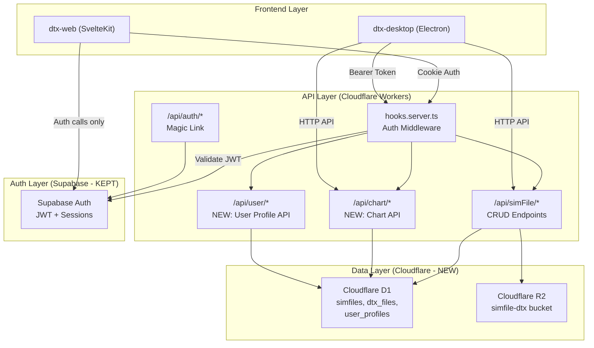
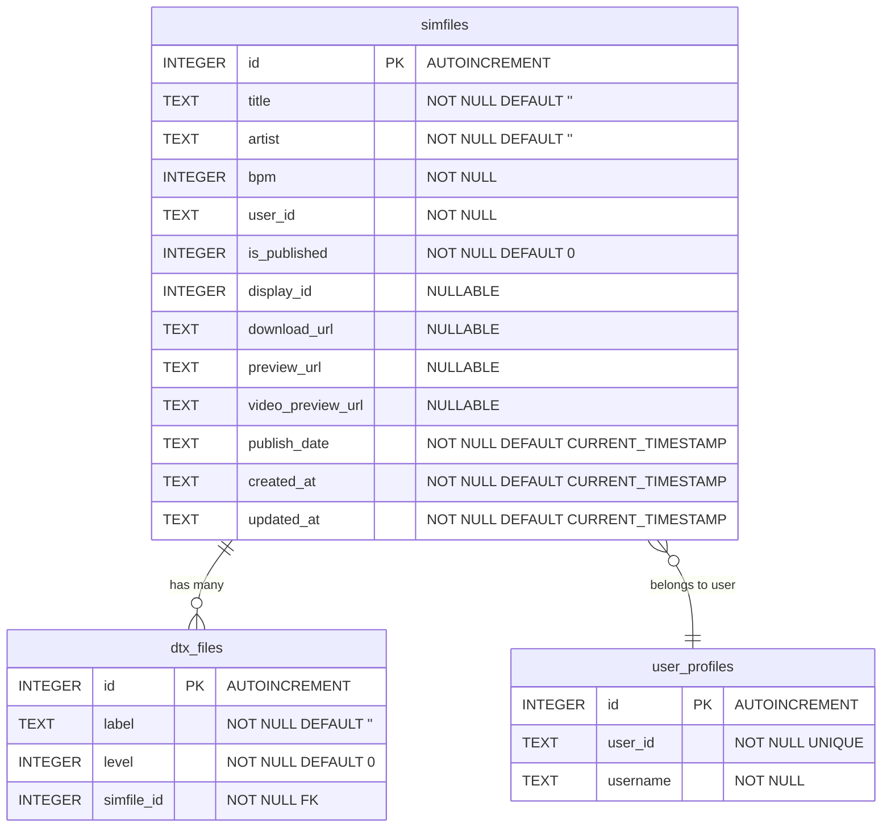

# Feature: Migrate Supabase Database to Cloudflare D1

## Goal

Migrate all Supabase PostgreSQL database usage (tables: `simfiles`, `dtx_files`, `user_profiles`) to Cloudflare D1 while preserving Supabase exclusively for authentication (`supabase.auth.*`). This decouples data storage from the auth provider, reduces external dependencies, co-locates data with the Cloudflare Workers runtime for lower latency, and eliminates Supabase database costs. The migration must maintain full backwards compatibility with both the web app (`dtx-web`) and the desktop app (`dtx-desktop`).

## Requirements

- **Keep Supabase Auth**: All `supabase.auth.*` calls (login, getUser, getSession, signOut, magic links, bearer token validation) remain untouched
- **Migrate 3 tables to D1**: `simfiles`, `dtx_files`, `user_profiles`
- **Replace all `supabase.from()` calls** with D1 SQL queries across both `dtx-web` (server routes + components) and `dtx-desktop` (main process)
- **New D1 API endpoints**: Desktop app currently queries Supabase directly from the main process — these must be replaced with server-side API endpoints that use D1
- **Type safety**: Replace Supabase-generated types with manually maintained TypeScript types compatible with D1 row shapes
- **Data migration**: Provide a one-time migration script to move existing data from Supabase PostgreSQL to D1
- **Foreign key**: `user_id` columns reference Supabase Auth `users.id` (UUID string) — no schema FK constraint in D1 but logically enforced
- **Cascade delete**: `dtx_files` must be deleted when parent `simfile` is deleted (application-level or D1 trigger)
- **Zero downtime**: Implement migration with a phased rollout to avoid service disruption

## Technical Considerations

### System Architecture Overview



**Key changes from current architecture:**

1. All database queries move from Supabase client SDK to D1 SQL via `platform.env.DB`
2. Desktop app stops making direct Supabase DB calls — routes through web API endpoints instead
3. Client-side components (ChartList.svelte, chart/[id]) call new SvelteKit server endpoints instead of Supabase directly
4. Supabase client in `hooks.server.ts` is retained **only** for auth operations

### Technology Stack Selection

| Layer         | Current                   | After Migration           | Rationale                                               |
| ------------- | ------------------------- | ------------------------- | ------------------------------------------------------- |
| Auth          | Supabase Auth             | Supabase Auth (unchanged) | Mature auth solution, magic links, JWT validation       |
| Database      | Supabase PostgreSQL       | Cloudflare D1 (SQLite)    | Co-located with Workers, lower latency, simpler billing |
| ORM/Query     | Supabase JS SDK `.from()` | Raw SQL via D1 binding    | D1 uses prepared statements, no ORM needed for 3 tables |
| File Storage  | Cloudflare R2             | Cloudflare R2 (unchanged) | Already on Cloudflare                                   |
| API Transport | Direct Supabase client    | SvelteKit API routes + D1 | All DB access server-side only                          |

### Database Schema Design (D1 / SQLite)



#### D1 Migration SQL

```sql
-- 0001_initial_schema.sql
CREATE TABLE IF NOT EXISTS simfiles (
    id INTEGER PRIMARY KEY AUTOINCREMENT,
    title TEXT NOT NULL DEFAULT '',
    artist TEXT NOT NULL DEFAULT '',
    bpm INTEGER NOT NULL,
    user_id TEXT NOT NULL,
    is_published INTEGER NOT NULL DEFAULT 0,
    display_id INTEGER,
    download_url TEXT,
    preview_url TEXT,
    video_preview_url TEXT,
    publish_date TEXT NOT NULL DEFAULT (datetime('now')),
    created_at TEXT NOT NULL DEFAULT (datetime('now')),
    updated_at TEXT NOT NULL DEFAULT (datetime('now'))
);

CREATE INDEX idx_simfiles_user_id ON simfiles(user_id);
CREATE INDEX idx_simfiles_is_published ON simfiles(is_published);
CREATE INDEX idx_simfiles_publish_date ON simfiles(publish_date);

CREATE TABLE IF NOT EXISTS dtx_files (
    id INTEGER PRIMARY KEY AUTOINCREMENT,
    label TEXT NOT NULL DEFAULT '',
    level INTEGER NOT NULL DEFAULT 0,
    simfile_id INTEGER NOT NULL,
    FOREIGN KEY (simfile_id) REFERENCES simfiles(id) ON DELETE CASCADE
);

CREATE INDEX idx_dtx_files_simfile_id ON dtx_files(simfile_id);

CREATE TABLE IF NOT EXISTS user_profiles (
    id INTEGER PRIMARY KEY AUTOINCREMENT,
    user_id TEXT NOT NULL UNIQUE,
    username TEXT NOT NULL
);

CREATE INDEX idx_user_profiles_user_id ON user_profiles(user_id);
```

#### Key SQLite/D1 Differences from PostgreSQL

- **Boolean**: SQLite uses `INTEGER` (0/1) instead of `BOOLEAN`
- **Timestamps**: SQLite uses `TEXT` with ISO format instead of `TIMESTAMP WITH TIME ZONE`
- **ILIKE**: SQLite uses `LIKE` (case-insensitive by default for ASCII)
- **AUTOINCREMENT**: Use `INTEGER PRIMARY KEY AUTOINCREMENT` instead of `SERIAL`
- **CASCADE**: Supported via `FOREIGN KEY ... ON DELETE CASCADE` (requires `PRAGMA foreign_keys = ON`)

### API Design

#### New Server Endpoints

All endpoints require authentication (existing `authGuard` middleware). The `user` is available from `event.locals.user`.

##### 1. `GET /api/chart` — List/Search Charts

**Query parameters:**

- `page` (number, default: 1)
- `pageSize` (number, default: 20)
- `search` (string, optional — filters by title/artist)
- `scope` (`mine` | `published`, default: `mine`)

**Response:**

```typescript
{
    data: SimfileWithDtx[];
    count: number;
}
```

**D1 Query (pseudocode):**

```sql
SELECT s.*, GROUP_CONCAT(json_object('level', d.level, 'label', d.label)) as dtx_files
FROM simfiles s
LEFT JOIN dtx_files d ON d.simfile_id = s.id
WHERE (s.user_id = ?user_id OR s.is_published = 1)
  AND (s.title LIKE ?search OR s.artist LIKE ?search)
GROUP BY s.id
ORDER BY s.publish_date DESC
LIMIT ?pageSize OFFSET ?offset
```

##### 2. `GET /api/chart/[id]` — Get Chart Detail

**Response:** `SimfileWithDtx` (single record with dtx_files)

##### 3. `PATCH /api/chart/[id]` — Update Chart

**Request body:** Partial simfile fields (`title`, `artist`, `bpm`, `is_published`, etc.)
**Authorization:** Owner only (`user_id` must match)

##### 4. `POST /api/chart` — Create Chart (used by desktop)

**Request body:**

```typescript
{
	title: string;
	artist: string;
	bpm: number;
	levels: {
		label: string;
		level: number;
	}
	[];
	// ... other optional fields
}
```

**Response:** Created `SimfileWithDtx`

##### 5. `GET /api/chart/search` — Search Charts (used by desktop)

**Query params:** `q` (search term), `exclude` (comma-separated IDs), `limit`

##### 6. `GET /api/user/profile` — Get User Profile

##### 7. `PUT /api/user/profile` — Create/Update User Profile

#### Existing Endpoints (Modified)

- `POST /api/simFile/upload` — Replace `supabase.from('simfiles')` ownership check with D1 query
- `DELETE /api/simFile/delete/[simfileID]` — Replace `supabase.from('simfiles')` with D1 queries
- `GET /api/simFile/listFiles/[simfileID]` — Replace `supabase.from('simfiles')` ownership check with D1

### Frontend Architecture

#### Component Changes

```
dtx-web Changes:
├── src/app.d.ts                          # Add DB binding to Platform.env
├── src/hooks.server.ts                   # Remove supabase.from() usage (auth-only)
├── src/lib/server/db.ts                  # NEW: D1 query helper + types
├── src/routes/
│   ├── api/
│   │   ├── chart/
│   │   │   ├── +server.ts                # NEW: List/Create charts
│   │   │   ├── [id]/+server.ts           # NEW: Get/Update chart
│   │   │   └── search/+server.ts         # NEW: Search charts
│   │   ├── user/
│   │   │   └── profile/+server.ts        # NEW: User profile CRUD
│   │   └── simFile/
│   │       ├── upload/+server.ts         # MODIFY: D1 ownership check
│   │       ├── delete/[simfileID]/+server.ts  # MODIFY: D1 queries
│   │       └── listFiles/[simfileID]/+server.ts  # MODIFY: D1 ownership check
│   └── (app)/app/chart/
│       └── [id]/+page.svelte             # MODIFY: Use API instead of direct Supabase
├── src/lib/components/
│   └── ChartList.svelte                  # MODIFY: Use API instead of direct Supabase

dtx-desktop Changes:
├── src/main/simfile-service.ts           # MODIFY: Replace supabase.from() with HTTP API calls
├── src/main/index.ts                     # MODIFY: Replace supabase.from() with HTTP API calls

packages/common Changes:
├── src/lib/types/supabase.types.ts       # MODIFY: Remove Supabase Database type
├── src/lib/types/d1.types.ts             # NEW: D1-compatible types
```

#### State Management Changes

**Before (Client-side Supabase):**

```
Component → supabase.from('table').select() → Supabase PostgreSQL
```

**After (Server API):**

```
Component → fetch('/api/chart') → SvelteKit Server → D1 binding → Cloudflare D1
```

Client-side components will use `fetch()` to call server endpoints instead of direct Supabase SDK calls. This eliminates the need for the Supabase client in components entirely (except for auth state).

### Security & Performance

#### Security

- **Auth unchanged**: JWT validation still via Supabase Auth in hooks.server.ts
- **No direct D1 access from client**: All queries go through authenticated server endpoints
- **SQL injection prevention**: Use D1 prepared statements with bound parameters exclusively
- **Ownership checks**: Server-side `user_id` verification on all mutation endpoints
- **CSRF**: Existing CSRF middleware remains

#### Performance

- **Lower latency**: D1 is co-located with Cloudflare Workers (same edge network)
- **No external roundtrip**: Eliminates Supabase PostgreSQL network hop from Workers
- **Connection pooling**: D1 handles connections automatically (no Supabase connection pool limits)
- **Caching**: D1 results can be cached at the edge via Cache API if needed
- **Pagination**: Server-side `LIMIT/OFFSET` for all list queries

### Deployment Architecture

#### Wrangler D1 Binding Configuration

```jsonc
// wrangler.jsonc additions
{
	"d1_databases": [
		{
			"binding": "DB",
			"database_name": "drumery-db",
			"database_id": "<to-be-created>"
		}
	],
	"env": {
		"pre-prod": {
			"d1_databases": [
				{
					"binding": "DB",
					"database_name": "drumery-db-preprod",
					"database_id": "<to-be-created>"
				}
			]
		}
	}
}
```

#### D1 Migrations Directory

```
packages/dtx-web/
├── d1-migrations/
│   └── 0001_initial_schema.sql
```

Apply with: `wrangler d1 migrations apply drumery-db --local` (dev) or `wrangler d1 migrations apply drumery-db --remote` (prod)

---

## Implementation Phases

### Phase 1: Foundation — D1 Schema, Bindings & Types

**Scope:** Set up D1 databases, create schema, configure wrangler bindings, create D1 type definitions and query helpers.

**Tasks:**

1. Create D1 databases for production and pre-prod via `wrangler d1 create`
2. Add D1 binding (`DB`) to `wrangler.jsonc` for both environments
3. Create `d1-migrations/0001_initial_schema.sql` with all 3 tables
4. Apply migration to local and remote D1 databases
5. Update `app.d.ts` to include `DB: D1Database` in `Platform.env`
6. Create `src/lib/server/db.ts` — D1 query helper with typed methods:
    - `getSimfile(db, id)`, `listSimfiles(db, filters)`, `createSimfile(db, data)`
    - `updateSimfile(db, id, data)`, `deleteSimfile(db, id)`
    - `getSimfileDtxFiles(db, simfileId)`, `createDtxFiles(db, data[])`
    - `getUserProfile(db, userId)`, `upsertUserProfile(db, data)`
7. Create `packages/common/src/lib/types/d1.types.ts` — D1 row types (replace Supabase `Database` type)
8. Update `cf-typegen` script or add D1 types to CloudflareBindings

### Phase 2: New Server API Endpoints

**Scope:** Build all new SvelteKit API routes that use D1.

**Tasks:**

1. `GET/POST /api/chart` — List charts (paginated, filtered) and create chart
2. `GET/PATCH /api/chart/[id]` — Get and update single chart
3. `GET /api/chart/search` — Search charts by title/artist (for desktop linking)
4. `GET/PUT /api/user/profile` — Get and upsert user profile
5. Add integration tests for each endpoint

### Phase 3: Migrate Existing Server Endpoints

**Scope:** Replace `supabase.from()` with D1 queries in existing API routes.

**Tasks:**

1. `POST /api/simFile/upload/+server.ts` — Replace Supabase ownership check with D1 query
2. `DELETE /api/simFile/delete/[simfileID]/+server.ts` — Replace all Supabase queries with D1
3. `GET /api/simFile/listFiles/[simfileID]/+server.ts` — Replace ownership check with D1
4. Verify R2 operations are unaffected

### Phase 4: Migrate Web Frontend Components

**Scope:** Update client-side components to use new API routes instead of Supabase.

**Tasks:**

1. `ChartList.svelte` — Replace `supabase.from('simfiles')` with `fetch('/api/chart')` calls
2. `chart/[id]/+page.svelte` — Replace direct Supabase queries with `fetch('/api/chart/[id]')` calls
3. Remove `supabase` from component props/context where only used for DB queries
4. Keep `supabase` available only for auth operations in `+layout.ts`

### Phase 5: Migrate Desktop App

**Scope:** Replace all direct Supabase DB calls in desktop main process with HTTP API calls.

**Tasks:**

1. `simfile-service.ts` — Replace `fetchUserSimFiles()` with API call to `GET /api/chart`
2. `simfile-service.ts` — Replace `createSimfileRecord()` with API call to `POST /api/chart`
3. `index.ts` — Replace search/fetch/update operations with API calls
4. Remove Supabase client DB usage from desktop (keep only for auth in `auth.ts`)

### Phase 6: Cleanup & Data Migration

**Scope:** Remove Supabase DB dependencies, migrate production data, update types.

**Tasks:**

1. Create data migration script (Supabase PostgreSQL → D1):
    - Export from Supabase: `supabase db dump --data-only`
    - Transform PostgreSQL SQL to SQLite-compatible SQL
    - Import to D1: `wrangler d1 execute --file=migration-data.sql`
2. Replace `supabase.types.ts` with `d1.types.ts` in `@dtx/common` exports
3. Update `gen-types` script to remove Supabase type generation
4. Remove `supabase` package dependency from `@dtx/common` if no longer needed
5. Remove `filterSerializedResponseHeaders` for `content-range` in hooks.server.ts
6. Clean up unused Supabase imports across all packages
7. Update `CLAUDE.md` and any documentation referencing Supabase DB

---

## Rollout Strategy

1. **Deploy Phase 1-3** to pre-prod — D1 schema + API endpoints + server migration
2. **Dual-write period**: Temporarily write to both Supabase and D1 (optional, for safety)
3. **Deploy Phase 4-5** to pre-prod — Frontend + Desktop use new APIs
4. **Run data migration** script against production D1
5. **Deploy all phases** to production
6. **Monitor** for 1-2 weeks, then execute Phase 6 cleanup
7. **Decommission** Supabase database (keep auth only)

## Risks & Mitigations

| Risk                                         | Impact            | Mitigation                                                                          |
| -------------------------------------------- | ----------------- | ----------------------------------------------------------------------------------- |
| D1 SQLite query differences from PostgreSQL  | Query failures    | Thorough testing of all ILIKE→LIKE, boolean→integer conversions                     |
| Data migration loss                          | Missing records   | Run migration with verification counts, keep Supabase DB read-only during migration |
| Desktop app version skew                     | API 404s          | Version API endpoints, maintain backward compatibility                              |
| D1 size limits (10GB free, 50GB paid)        | Storage cap       | Current dataset is small; monitor via Cloudflare dashboard                          |
| D1 row limits per query (default batch size) | Pagination issues | Enforce server-side pagination with reasonable limits                               |
